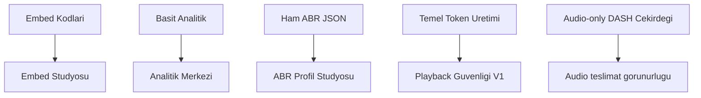
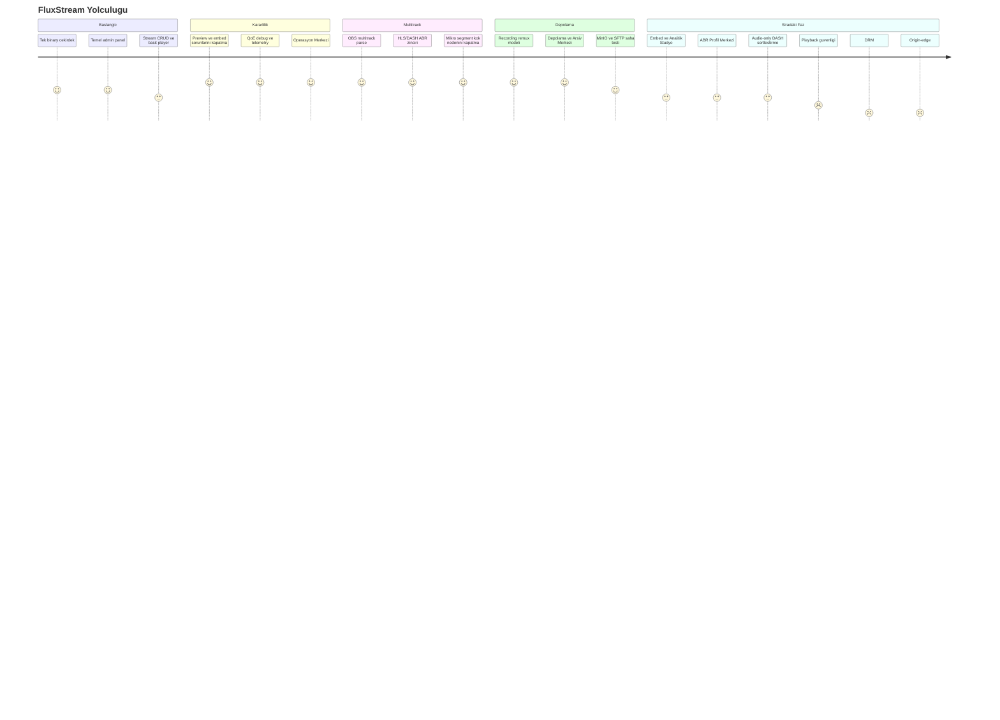
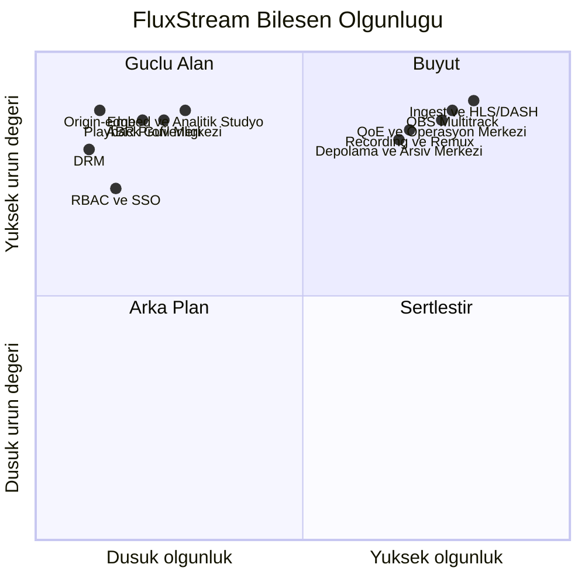
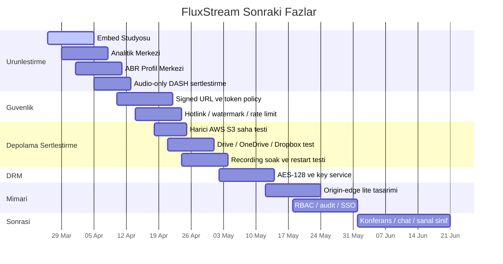

# FluxStream Yol Haritasi

Tarih: 26 Mart 2026

Bu dokuman, cekirdegin nereden nereye geldigini ve bundan sonra hangi
fazlara girecegini tek yerde gormek icin hazirlandi.

## 1. Buyuk Resim

```mermaid
flowchart LR
    A[Ham Streaming Cekirdegi] --> B[Player ve Embed Kararliligi]
    B --> C[OBS Multitrack ve ABR]
    C --> D[QoE ve Operasyon Merkezi]
    D --> E[Kayit Arsiv ve Yedek Merkezi]
    E --> F[Embed ve Analitik Studyo Fazı]
    F --> G[Playback Guvenligi]
    G --> H[DRM]
    H --> I[Origin-Edge ve Enterprise Faz]
    I --> J[Konferans Chat Sanal Sinif]
```

## 1.1 Son Fazda Nereye Geldik

## 2. Nereden Nereye Geldik

### 2.1 Yolculuk Ozeti

### 2.2 Milestone Tablosu

| Faz | Durum | Kisa Not |
|---|---|---|
| Temel ingest ve dagitim | Tamamlandi | HLS, DASH, recording ve admin panel omurgasi oturdu |
| Player ve preview kararliligi | Tamamlandi | embed, iframe, direct link ve offline hatalari kapandi |
| OBS multitrack ve ABR | Tamamlandi | HLS/DASH varyant zinciri ve chunk timestamp kok nedeni kapandi |
| QoE ve Operasyon Merkezi | Tamamlandi | telemetry, track analytics, Prometheus ve teshis ekrani var |
| Depolama ve Arsiv Merkezi | Buyuk oranda tamamlandi | kayit, arsiv, yedek ve bulut hedefleri tek merkezde |
| Embed + Analitik + ABR Studyo | Tamamlandi | embed, analitik ve ABR ekranlari urun seviyesine tasindi |
| Harici storage saha testi | Kismen tamamlandi | ayni VPS uzerinde MinIO + SFTP test edildi, gercek S3 sirada |
| Playback guvenligi | Buyuk oranda tamamlandi | signed URL, token, domain/IP kisiti ve watermark omurgasi panel tarafina baglandi |
| DRM | Baslamadi | AES-128, DRM abstraction ve lisans servisleri acik |
| Origin-edge / cluster | Baslamadi | dusuk butceye uygun lite model tasarlanacak |
| Konferans / chat / sanal sinif | Baslamadi | cekirdek streaming tarafi tamamen oturduktan sonra |

## 3. Bugunku Mimari Olgunluk

## 4. Bugunku Gercek Durum

### Guclu Alanlar

- tek-node canli dagitim cekirdegi artik guven veriyor
- OBS multitrack ve ABR omurgasi calisiyor
- QoE, track ve manifest gorunurlugu var
- recording ve depolama tarafi urun hissi vermeye basladi
- ayni urunde admin panel, operasyon, yedek ve arsiv bir arada

### Hala Acik Olanlar

- harici AWS S3 saha testi
- rclone tabanli populer bulut hedeflerinin gercek hesaplarla dogrulanmasi
- `Embed Stüdyosu`, `Analitik Merkezi` ve `ABR Profilleri` ekranlarinin urun seviyesine tasinmasi
- `audio-only DASH` istemci saha testleri
- playback guvenligi
- DRM
- origin-edge
- RBAC, audit log ve SSO

## 5. Siradaki Yol

## 6. Once Neyi Bitirecegiz

1. `Embed Stüdyosu` ekranini urun seviyesine tasiyacagiz.
2. `Analitik Merkezi` ekranini daha guclu KPI ve grafiklerle yeniden kuracagiz.
3. `ABR Profilleri ve Teslimat Merkezi`ni form tabanli profil mantigina gecirecegiz.
4. Ayni faz icinde `audio-only DASH` istemci sertlestirmesini kapatacagiz.
5. Ayni faz icinde playback guvenligi v1 katmanini ekleyecegiz.
6. Sonra harici AWS S3 ve populer bulut hedeflerinin gercek saha testlerine donecegiz.
7. Daha sonra DRM ve origin-edge mimarisine gececegiz.

## 7. Bu Cekirdegin Uzerine Neler Insa Edilebilir

### Bugunden Yarin Cikabilecek Urunler

- kurumsal TV ve kurum ici yayin platformu
- radyo ve audio streaming platformu
- markali webcast ve webinar urunu
- arsiv / catch-up ve VOD portali
- egitim yayini ve sinif ici canli ders omurgasi

### Cekirdek Tamamlandiktan Sonra

- konferans odalari
- canli chat
- moderasyonlu soru-cevap
- sanal sinif rolleri
- yoklama
- breakout room
- takim ici mesajlasma

## 8. Tek Cumlelik Ozet

FluxStream, ham bir streaming denemesi olmaktan cikti; artik iyi bir
tek-node medya sunucusu ve urunlesmeye yaklasmis bir yayin cekirdegi.
