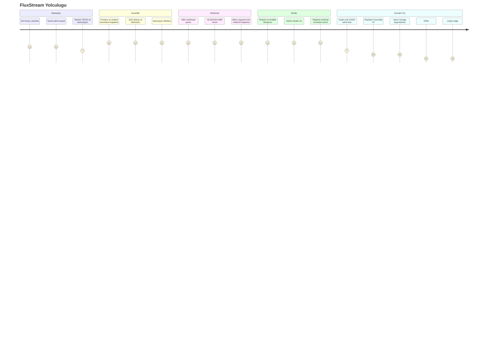
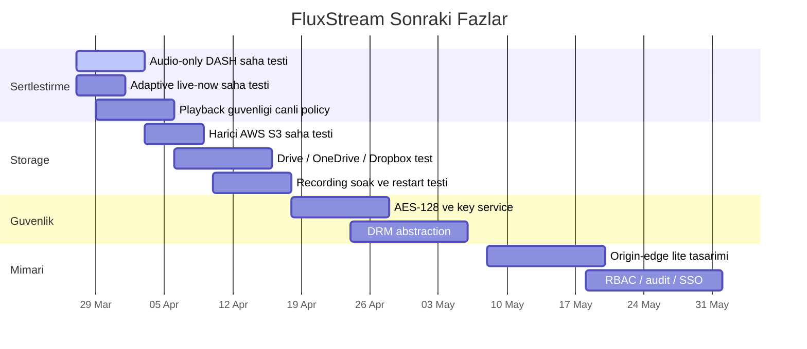

# FluxStream Yol Haritasi

Tarih: 26 Mart 2026

Bu dokuman, cekirdegin nereden nereye geldigini ve bundan sonra hangi
fazlara girecegini tek yerde gormek icin hazirlandi.

## 1. Buyuk Resim

```mermaid
flowchart LR
    A[Ham Streaming Cekirdegi] --> B[Player ve Embed Kararliligi]
    B --> C[OBS Multitrack ve ABR]
    C --> D[QoE ve Operasyon Merkezi]
    D --> E[Kayit Arsiv ve Yedek Merkezi]
    E --> F[Embed Analitik ve ABR Studyosu]
    F --> G[Admin Studio V2]
    G --> H[Adaptive Teslimat Sonradan Acma]
    H --> I[Playback Guvenligi V2]
    I --> J[DRM]
    J --> K[Origin-Edge ve Enterprise Faz]
    K --> L[Konferans Chat Sanal Sinif]
```

## 2. Son Buyuk Milestone'lar

| Faz | Durum | Kisa Not |
|---|---|---|
| Temel ingest ve dagitim | Tamamlandi | HLS, DASH, recording ve admin panel omurgasi oturdu |
| Player ve preview kararliligi | Tamamlandi | embed, iframe, direct link ve offline hatalari kapandi |
| OBS multitrack ve ABR | Tamamlandi | HLS/DASH varyant zinciri ve timestamp kok nedeni kapandi |
| QoE ve Operasyon Merkezi | Tamamlandi | telemetry, track analytics ve teshis akisi var |
| Depolama ve Arsiv Merkezi | Buyuk oranda tamamlandi | kayit, arsiv, yedek ve bulut hedefleri tek merkezde |
| Embed + Analitik + ABR Studyosu | Tamamlandi | embed, analitik ve ABR ekranlari urunlesti |
| Admin Studio V2 | Tamamlandi | dashboard, streams, ayarlar, diagnostics ve marka ekranlari urunlesti |
| Adaptive Teslimat Sonradan Acma | Tamamlandi | stream sonradan adaptive teslimata alinabiliyor |
| Harici storage saha testi | Kismen tamamlandi | ayni VPS uzerinde MinIO + SFTP test edildi, gercek S3 sirada |
| Playback guvenligi V1 | Buyuk oranda tamamlandi | signed URL, token, domain/IP kisiti ve watermark omurgasi var |
| DRM | Baslamadi | AES-128 ve abstraction katmani acik |
| Origin-edge / cluster | Baslamadi | dusuk butceye uygun lite model tasarlanacak |

## 3. Bugunku Durum

## 4. Siradaki Yol

## 5. Bu Cekirdegin Uzerine Neler Insa Edilebilir

- kurumsal TV ve kurum ici yayin platformu
- radyo ve audio streaming platformu
- markali webcast ve webinar urunu
- arsiv / catch-up ve VOD portali
- egitim yayini ve sinif ici canli ders omurgasi

Sonraki buyuk adimlar:

- playback guvenligi V2
- DRM
- origin-edge lite
- sonra konferans, chat ve sanal sinif katmanlari
